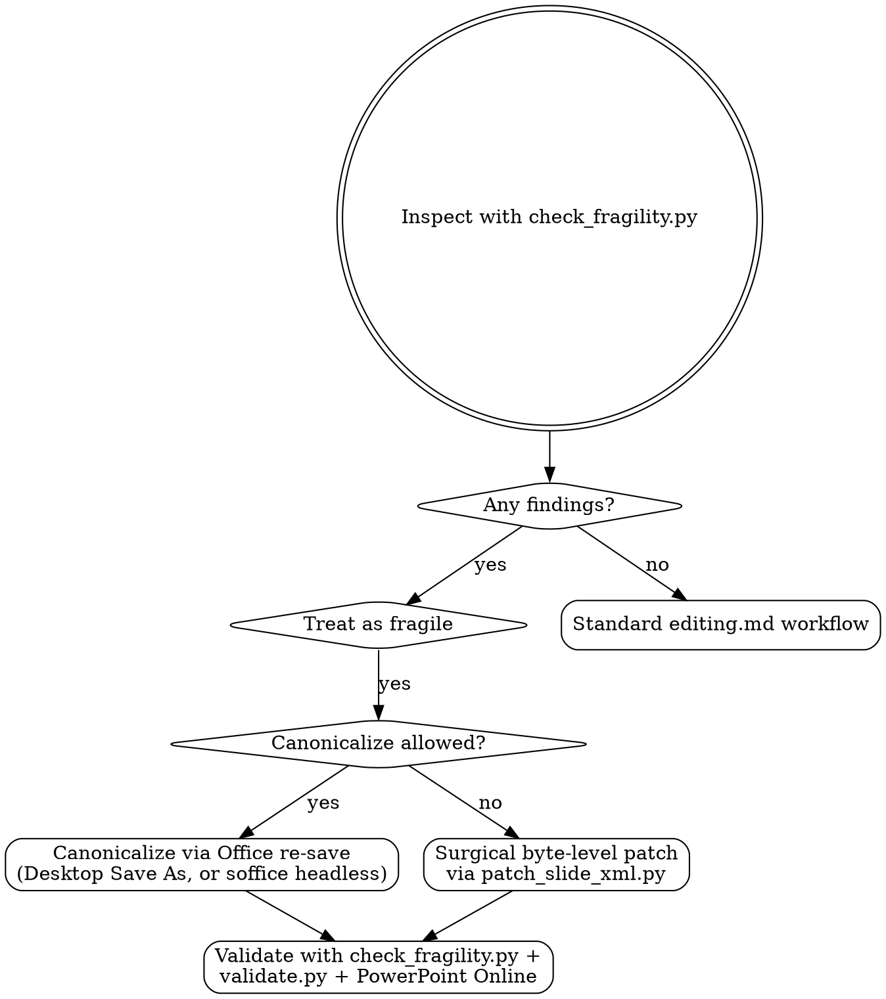

# Recovering Fragile Decks (Walnut Exporter and friends)

Use this guide whenever a `.pptx` was produced by something other than a real
Microsoft Office app or LibreOffice — third-party exporters such as
**Walnut Exporter**, Aspose, Syncfusion, Spire, GemBox, OpenXML SDK
pipelines, or anything that hand-assembles OOXML parts.

> **Background:** A real-world Walnut Exporter deck shipped with
> 19 image files but only 4 unique blobs (one image duplicated 10×, another
> 5×), 4 293 inline `xmlns:*` attributes vs the ~557 a real Office app emits,
> a `Default Extension="xml"` content-type pointing at `core-properties`,
> a theme misfiled under `notesMasters/`, no `slideLayout1.xml`, random-hex
> relationship IDs, self-closing `<a:xfrm/>` shells, and `Slides=0 Notes=0`
> in `docProps/app.xml` on a 12-slide deck. PowerPoint Desktop silently
> repaired it on open (writing a 71%-smaller `…  -  Repaired.pptx` companion).
> A subsequent `python-pptx` re-save changed the XML declaration from
> `<?xml version="1.0" encoding="utf-8"?>` to
> `<?xml version='1.0' encoding='UTF-8' standalone='yes'?>` and that was
> enough to break the file in **both PowerPoint Online and PowerPoint
> Desktop**, even though LibreOffice and python-pptx itself could still
> parse it.

## When this applies

Run [`scripts/check_fragility.py`](scripts/check_fragility.py) on the file.
Treat the deck as fragile if **any** of the following is true:

- `docProps/app.xml` Application is not `Microsoft …` or `LibreOffice …`
- Image dedup ratio is poor (the script reports `image-duplication`)
- A slide carries more than ~60 inline `xmlns:*` declarations
- `[Content_Types].xml` uses `Default Extension="xml"` for core-properties
- `slideLayout1.xml` is missing
- A theme file lives under `notesMasters/theme/` or `slideMasters/theme/`
- Relationship IDs are random hex (`R5d79687aac73441e`) instead of `rId1`
- Self-closing `<a:xfrm/>` shells appear in slide XML
- `docProps/app.xml` claims `Slides=0` or `Notes=0` on a non-empty deck

A deck producing any **fail**-level finding will probably refuse to open in
PowerPoint Online; a deck producing only **warn**-level findings is fragile
enough that a python-pptx full-save can push it over the edge.

```bash
python pptx-custom/scripts/check_fragility.py deck.pptx
# exits 0 only when no signals are found
```

### Machine-readable output (`--json`)

For automation, pass `--json` and pipe through `jq`. The script always
emits a JSON array (one entry per file passed on the command line),
each entry shaped like this:

```json
[
  {
    "path": "deck.pptx",
    "worst": "fail",
    "summary": {
      "application": "Microsoft Macintosh PowerPoint",
      "creator": "Walnut Exporter",
      "declared_slides": 12,
      "declared_notes": 12,
      "actual_slides": 12,
      "actual_notes": 12,
      "media_files": 19,
      "unique_media_blobs": 4,
      "duplicate_media_wasted_bytes": 1344109,
      "inline_xmlns_per_slide": {
        "ppt/slides/slide1.xml": 271
      },
      "rel_ids_canonical": 0,
      "rel_ids_random_hex": 92
    },
    "findings": [
      {
        "code": "creator-fragile",
        "severity": "fail",
        "message": "docProps/core.xml dc:creator = 'Walnut Exporter' …",
        "details": { "creator": "Walnut Exporter" }
      }
    ]
  }
]
```

| Field | Type | Meaning |
| --- | --- | --- |
| `path` | string | The file argument exactly as passed on the CLI. |
| `worst` | `"info"` \| `"warn"` \| `"fail"` | Highest severity across all findings. Stays at the default `"info"` when `findings` is empty (no signals) — pair with a length check or with the process exit code (0 = clean, 1 = any finding) to disambiguate. |
| `summary.application` | string | `docProps/app.xml` Application value, if present. |
| `summary.creator` | string | `docProps/core.xml` `dc:creator`, only present when the value matches a known-fragile producer. |
| `summary.declared_slides` / `summary.declared_notes` | int \| null | What `app.xml` claims. `null` when the field is absent. |
| `summary.actual_slides` / `summary.actual_notes` | int | Counted from the zip member list. |
| `summary.media_files` | int | Files under `ppt/media/`. |
| `summary.unique_media_blobs` | int | Distinct SHA-256 hashes across the media files. |
| `summary.duplicate_media_wasted_bytes` | int | Bytes that would be saved if media were deduplicated. |
| `summary.inline_xmlns_per_slide` | object | Per-slide count of `xmlns:*` attributes (root + inline). |
| `summary.rel_ids_canonical` / `summary.rel_ids_random_hex` | int | Relationship-ID style counts. |
| `findings[].code` | string | Stable identifier (`exporter-fragile`, `creator-fragile`, `image-duplication`, `inline-xmlns-spam`, `content-types-default-xml`, `slideLayout1-missing`, `theme-misplaced`, `rel-id-random-hex`, `empty-xfrm`, `app-slide-mismatch`, `app-notes-mismatch`, `app-missing`, `content-types-missing`, `bad-zip`, `file-missing`, `not-a-file`). |
| `findings[].severity` | `"info"` \| `"warn"` \| `"fail"` | Per-finding severity. |
| `findings[].message` | string | Human-readable description. |
| `findings[].details` | object | Code-specific context (path lists, counts, etc.). |

Useful one-liners:

```bash
# Worst severity for a single deck (prints info / warn / fail).
python pptx-custom/scripts/check_fragility.py --json deck.pptx | jq -r '.[0].worst'

# List the finding codes that fired.
python pptx-custom/scripts/check_fragility.py --json deck.pptx \
    | jq -r '.[0].findings[].code'

# Filter a batch to only fail-level decks.
python pptx-custom/scripts/check_fragility.py --json deck*.pptx \
    | jq -r '.[] | select(.worst=="fail") | .path'
```

## Decision flow



## Path A — canonicalize, then edit normally (preferred)

This is the safe path when you are allowed to replace the file's
serialization. Both options below produce an OOXML package that conforms to
what a real Office app writes, after which the standard
[`editing.md`](editing.md) workflow is safe again.

### A1. PowerPoint Desktop "Save As"

If the user already has PowerPoint Desktop installed:

1. Open the deck in PowerPoint Desktop. If a `… - Repaired.pptx` companion
   appears, use **that** as the canonical source going forward.
2. **File → Save As → PowerPoint Presentation (.pptx)**, overwriting the
   original (or saving alongside under a `canonical/` subfolder).
3. Re-run `check_fragility.py`; all findings should clear.
4. Move the original Walnut export to an `originals/` subfolder for
   provenance.

### A2. LibreOffice headless re-save

Cross-platform automation when PowerPoint Desktop is not available.
Uses the existing `office-custom/scripts/soffice.py` wrapper:

```bash
# Re-save through LibreOffice to canonicalize the OOXML serialization.
python office-custom/scripts/soffice.py --headless \
    --convert-to pptx --outdir canonical/ deck.pptx

# REQUIRED: verify the canonical file was actually produced.
# soffice can exit 0 and print "Unspecified Application Error" on
# severely malformed XML (e.g. duplicate attribute names on the same
# element) without producing any output file. If the output is missing,
# fall back to Path A1 — PowerPoint Desktop's parser is more tolerant
# than LibreOffice's on the malformed-but-still-parseable-in-Office
# corner cases.
test -f canonical/deck.pptx || {
    echo "soffice produced no output — fall back to PowerPoint Desktop (Path A1)."
    exit 1
}

# Now verify the canonicalized file.
python pptx-custom/scripts/check_fragility.py canonical/deck.pptx
python office-custom/scripts/validate.py canonical/deck.pptx
```

LibreOffice re-save normalizes namespace declarations, deduplicates images,
rewrites relationship IDs to canonical `rIdN`, and fills in
`<a:xfrm>` children. It does **not** preserve every visual nuance of the
original (font fallbacks, exotic gradients, and some chart features can
shift), so always run a visual QA pass afterwards — see
[`SKILL.md`](SKILL.md) §`QA (Required)`.

#### When LibreOffice refuses the file

`soffice` rejects decks whose XML is not well-formed (the same parent
element carries two attributes with the same name; an element name is
malformed; the package is truncated). The skill's `check_fragility.py`
will still parse and rate these because it works on byte-level regex,
not a full XML parser — so a deck can score "fragile but salvageable"
with `check_fragility.py` and yet be unsalvageable through LibreOffice.

Recovery options in this case, in order of preference:

1. **PowerPoint Desktop Save As** (Path A1) — Office's parser is the most
   tolerant in practice; it routinely repairs files LibreOffice rejects.
2. **Use the `… - Repaired.pptx` companion** (Path C) — if PowerPoint
   has already produced one, that file is canonical and safe to edit
   with the standard [`editing.md`](editing.md) flow.
3. **Surgical byte-level patch** (Path B below) — when the goal is a
   small targeted edit and full canonicalization is not required.

After either A1 or A2, edit the canonical copy with the regular
[`editing.md`](editing.md) workflow.

## Path B — surgical byte-level patch (use when you must preserve the file)

Use this when:

- The Walnut original is needed verbatim (audit trail, contractual deliverable).
- Canonicalization would lose layout fidelity that you cannot afford.
- You only need to change a handful of bytes (a typo, a date, an attribution).

The principle: read every untouched member byte-identical from the source
zip, patch only the bytes that must change in the targeted member, and write
the result. The XML declaration and every byte of every untouched member are
preserved exactly. This avoids the failure mode that broke the deck in
PowerPoint Desktop and Online after the python-pptx full-save.

### Why python-pptx and ElementTree are unsafe here

- `python-pptx`'s save rewrites the XML declaration to
  `<?xml version='1.0' encoding='UTF-8' standalone='yes'?>` (single quotes,
  uppercase encoding, explicit `standalone`). On a fragile base this single
  change has been observed to break opens in both PowerPoint Online **and**
  PowerPoint Desktop.
- `ElementTree.tostring(...)` (which `office-custom/scripts/pack.py` uses
  during `condense_xml`) reorders xmlns attribute declarations and re-emits
  the declaration in its own canonical form. Same risk.
- A full `zipfile.ZipFile(..., "w")` rebuild from an unpacked tree re-deflates
  every member and drops the original ZIP comment. Even when the bytes inside
  each member are unchanged, the surrounding ZIP framing changes.

### Single-file substring edit

```bash
python pptx-custom/scripts/patch_slide_xml.py \
    Walnut_Original.pptx Walnut_Patched.pptx \
    --member ppt/slides/slide1.xml \
    --replace "Old headline" "New headline"
```

The script refuses to write if any `--replace` target is not present, so a
silently missed edit cannot slip through.

### Multi-member batch edits

For more than a couple of changes, use a JSON spec so the edits are
reviewable and reproducible:

```json
{
  "ppt/slides/slide1.xml": [
    {"kind": "substring", "find": "Old headline", "replace": "New headline"}
  ],
  "ppt/slides/slide3.xml": [
    {"kind": "regex", "pattern": "Draft v\\d+", "replace": "Final"}
  ]
}
```

```bash
python pptx-custom/scripts/patch_slide_xml.py \
    Walnut_Original.pptx Walnut_Patched.pptx --spec edits.json
```

### Verifying a surgical patch

After patching:

```bash
# 1. ZIP and XML integrity.
python office-custom/scripts/validate.py Walnut_Patched.pptx

# 2. Confirm no NEW fragility signals were introduced.
python pptx-custom/scripts/check_fragility.py Walnut_Patched.pptx

# 3. Confirm every untouched member is byte-identical to the original.
python - <<'PY'
import sys, zipfile
orig, patched = sys.argv[1], sys.argv[2]
with zipfile.ZipFile(orig) as a, zipfile.ZipFile(patched) as b:
    names = sorted(set(a.namelist()) | set(b.namelist()))
    for n in names:
        ad = a.read(n) if n in a.namelist() else None
        bd = b.read(n) if n in b.namelist() else None
        if ad != bd:
            print("CHANGED", n, len(ad or b''), "->", len(bd or b''))
PY Walnut_Original.pptx Walnut_Patched.pptx

# 4. Open the patched file in PowerPoint Online AND PowerPoint Desktop.
#    Desktop opening with no "Repaired" companion is the bar to clear.
```

The third check is the most important: only the file(s) you intended to edit
should appear in the `CHANGED` list. Anything else is a silent rewrite.

## Path C — last resort: rebuild on top of the Repaired copy

If both canonicalization and surgical patching are off the table because the
file has already been opened by PowerPoint Desktop and you have a
`… - Repaired.pptx` companion, treat that companion as the new source of
truth and discard the original Walnut export. PowerPoint's repair output is
canonical OOXML; the standard [`editing.md`](editing.md) workflow is safe
against it.

## Hand-off rules to other skills

- The standard unpack → edit → pack flow described in
  [`editing.md`](editing.md) is **only safe** for decks that pass
  `check_fragility.py` with zero findings.
- `office-custom/scripts/pack.py` does an ElementTree XML round-trip; treat
  it as canonicalizing, never as preserving, even when no auto-repair was
  needed.
- For text extraction (`markitdown`) and visual QA (`thumbnail.py`,
  `pdftoppm`), fragility doesn't matter — those workflows read the file
  without rewriting it.

## See also

- [`SKILL.md`](SKILL.md) — top-level router and visual QA workflow.
- [`editing.md`](editing.md) — standard unpack/edit/repack flow for
  non-fragile decks.
- [`pptxgenjs.md`](pptxgenjs.md) — building a fresh deck from scratch, the
  cleanest alternative when a Walnut original cannot be salvaged.
